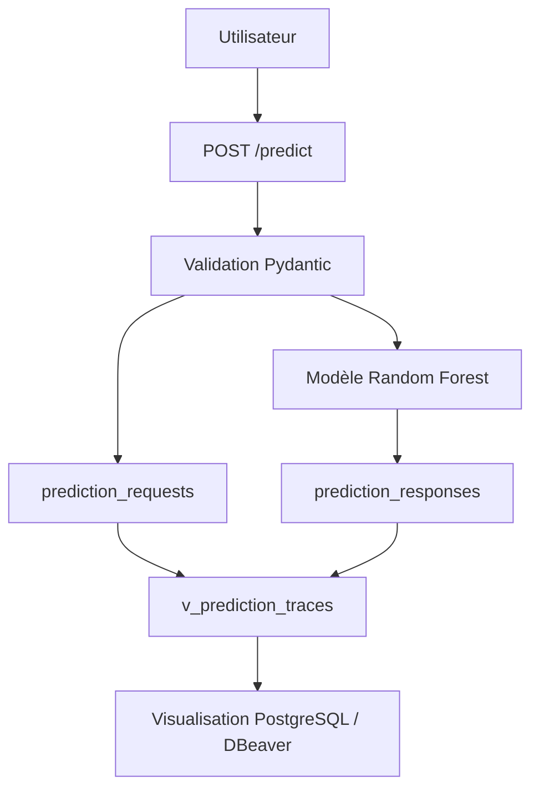

# 🚀 P5 — Déployez un modèle de Machine Learning

API de prédiction d’attrition collaborateur, développée avec **FastAPI**, un modèle **RandomForestClassifier**, une base **PostgreSQL** locale pour la traçabilité, une suite de tests **Pytest**, et un déploiement via **Hugging Face Spaces**.

---

## 📌 Sommaire

* [À propos du projet](#-à-propos-du-projet)
* [Objectifs](#-objectifs)
* [Architecture globale](#-architecture-globale)
* [Technologies utilisées](#-technologies-utilisées)
* [Installation locale](#-installation-locale)
* [API FastAPI](#-api-fastapi)
* [Exemple d’utilisation de `/predict`](#-exemple-dutilisation-de-predict)
* [Modèle de machine learning](#-modèle-de-machine-learning)
* [Base PostgreSQL et traçabilité](#-base-postgresql-et-traçabilité)
* [Visualisation avec DBeaver](#-visualisation-avec-dbeaver)
* [Générer plus de traces de prédiction](#-générer-plus-de-traces-de-prédiction)
* [Tests unitaires et fonctionnels](#-tests-unitaires-et-fonctionnels)
* [CI/CD et déploiement](#-cicd-et-déploiement)
* [Déploiement Hugging Face Spaces](#-déploiement-hugging-face-spaces)
* [Documentation technique](#-documentation-technique)
* [Maintenance du modèle](#-maintenance-du-modèle)
* [Reproductibilité](#-reproductibilité)
* [Commandes opérationnelles](#-commandes-opérationnelles)
* [Roadmap](#-roadmap)
* [Versions du projet](#-versions-du-projet)
* [Limites connues](#-limites-connues)
* [Contact](#-contact)

---

## 🎯 À propos du projet

Ce projet expose un modèle de machine learning de prédiction d’attrition via une API REST.

L’objectif est de fournir une architecture complète permettant :

* d’entraîner et d’exporter un modèle de machine learning ;
* de charger ce modèle dans une API FastAPI ;
* d’exposer des endpoints documentés avec Swagger/OpenAPI ;
* de stocker le dataset complet dans PostgreSQL ;
* de tracer les inputs et outputs de chaque prédiction ;
* de tester les composants critiques du projet ;
* de générer un rapport de couverture de tests ;
* de déployer l’API sur Hugging Face Spaces.

Le projet s’appuie sur le dataset central du projet P4, utilisé ici pour entraîner un modèle de prédiction d’attrition collaborateur.

---

## ✅ Objectifs

| Objectif                                        | Statut    |
| ----------------------------------------------- | --------- |
| Exposer un modèle ML via une API REST           | ✅ Réalisé |
| Documenter l’API avec Swagger/OpenAPI           | ✅ Réalisé |
| Charger un modèle exporté au format `joblib`    | ✅ Réalisé |
| Tracer les prédictions en base PostgreSQL       | ✅ Réalisé |
| Fournir une documentation technique exploitable | ✅ Réalisé |
| Ajouter des tests unitaires et fonctionnels     | ✅ Réalisé |
| Générer un rapport de couverture                | ✅ Réalisé |
| Déployer l’API sur Hugging Face Spaces          | ✅ Réalisé |
| Définir un protocole de maintenance du modèle   | ✅ Réalisé |

---

## 🏗️ Architecture globale

Le flux global du projet est le suivant :

```text
Utilisateur
   ↓
API FastAPI
   ↓
Validation Pydantic
   ↓
Modèle Random Forest
   ↓
Réponse de prédiction
   ↓
Traçabilité PostgreSQL
```

Vue synthétique :

```text
Dataset P4
   ↓
Préparation des données
   ↓
Entraînement RandomForestClassifier
   ↓
Export joblib + metadata JSON
   ↓
Chargement dans FastAPI
   ↓
Endpoints /health, /model-info, /predict
   ↓
Tests + couverture
   ↓
Déploiement Hugging Face Spaces
```

### Schéma de traçabilité



---

## 🧱 Technologies utilisées

| Technologie         | Rôle                                               |
| ------------------- | -------------------------------------------------- |
| Python 3.11         | Langage principal                                  |
| FastAPI             | API REST et documentation OpenAPI                  |
| Pydantic            | Validation des données entrantes et sortantes      |
| Scikit-learn        | Entraînement du modèle ML                          |
| Joblib              | Export et chargement du pipeline ML                |
| PostgreSQL          | Stockage du dataset et traçabilité des prédictions |
| SQLAlchemy          | Connexion applicative à PostgreSQL                 |
| Pytest              | Tests unitaires et fonctionnels                    |
| Pytest-cov          | Rapport de couverture de tests                     |
| Docker              | Conteneurisation pour le déploiement               |
| GitHub Actions      | CI/CD                                              |
| Hugging Face Spaces | Déploiement de l’API                               |
| DBeaver             | Visualisation de la base PostgreSQL locale         |

---

## ⚙️ Installation locale

### Prérequis

Avant de lancer le projet, installer :

* Python 3.11 ;
* PostgreSQL ;
* Git ;
* DBeaver Community, optionnel mais utile pour explorer la base PostgreSQL ;
* un environnement virtuel Python.

### Cloner le repository

```bash
git clone https://github.com/VincentDesmouceaux/P5_deployez_un_modele_de_machine_learning.git
cd P5_deployez_un_modele_de_machine_learning
```

### Créer et activer l’environnement virtuel

```bash
python -m venv .venv
source .venv/bin/activate
```

Vérifier que l’environnement virtuel est bien actif :

```bash
which python
python -V
```

Résultat attendu :

```text
.venv/bin/python
Python 3.11.x
```

### Installer les dépendances

```bash
python -m pip install --upgrade pip
python -m pip install -r requirements.txt
```

### Vérification rapide

```bash
which python && python -V
```

Cette commande permet de vérifier que le projet utilise bien l’environnement Python local.

---

## ⚡ API FastAPI

L’API expose les endpoints suivants :

| Endpoint      | Méthode | Description                                                                |
| ------------- | ------- | -------------------------------------------------------------------------- |
| `/`           | GET     | Redirige vers la documentation Swagger                                     |
| `/health`     | GET     | Vérifie que l’API fonctionne                                               |
| `/model-info` | GET     | Retourne les informations du modèle chargé                                 |
| `/predict`    | POST    | Envoie les données d’un collaborateur au modèle et retourne une prédiction |

### Lancer l’API localement

```bash
python -m uvicorn app.main:app --reload
```

L’API est ensuite disponible à l’adresse :

```text
http://127.0.0.1:8000
```

### Documentation Swagger locale

```text
http://127.0.0.1:8000/docs
```

Swagger permet de tester directement les endpoints depuis le navigateur.

### Commandes utiles

Vérifier que l’API répond :

```bash
curl http://127.0.0.1:8000/health
```

Vérifier les métadonnées du modèle chargé :

```bash
curl http://127.0.0.1:8000/model-info
```

Ouvrir Swagger :

```bash
open http://127.0.0.1:8000/docs
```

---

## 🔮 Exemple d’utilisation de `/predict`

### Exemple de payload JSON

```json
{
  "age": 41,
  "genre": "F",
  "revenu_mensuel": 5993,
  "statut_marital": "Célibataire",
  "departement": "Commercial",
  "poste": "Cadre Commercial",
  "nombre_experiences_precedentes": 8,
  "nombre_heures_travailless": 80,
  "annee_experience_totale": 8,
  "annees_dans_l_entreprise": 6,
  "annees_dans_le_poste_actuel": 4,
  "satisfaction_employee_environnement": 2,
  "note_evaluation_precedente": 3,
  "niveau_hierarchique_poste": 2,
  "satisfaction_employee_nature_travail": 4,
  "satisfaction_employee_equipe": 1,
  "satisfaction_employee_equilibre_pro_perso": 1,
  "note_evaluation_actuelle": 3,
  "heure_supplementaires": "Oui",
  "augementation_salaire_precedente": 11,
  "nombre_participation_pee": 0,
  "nb_formations_suivies": 0,
  "nombre_employee_sous_responsabilite": 0,
  "distance_domicile_travail": 1,
  "niveau_education": 2,
  "domaine_etude": "Sciences de la Vie",
  "ayant_enfants": "Y",
  "frequence_deplacement": "Occasionnel",
  "annees_depuis_la_derniere_promotion": 0,
  "annes_sous_responsable_actuel": 5
}
```

### Exemple de réponse

```json
{
  "prediction": 1,
  "prediction_label": "leave",
  "probability_leave": 0.8955,
  "model_name": "attrition-random-forest",
  "model_version": "0.5.0"
}
```

### Règle de décision

```text
probability_leave >= 0.5 → leave
probability_leave < 0.5  → stay
```

### Commande utile

Tester `/predict` directement depuis le terminal :

```bash
curl -X POST "http://127.0.0.1:8000/predict" \
  -H "Content-Type: application/json" \
  -d '{
    "age": 41,
    "genre": "F",
    "revenu_mensuel": 5993,
    "statut_marital": "Célibataire",
    "departement": "Commercial",
    "poste": "Cadre Commercial",
    "nombre_experiences_precedentes": 8,
    "nombre_heures_travailless": 80,
    "annee_experience_totale": 8,
    "annees_dans_l_entreprise": 6,
    "annees_dans_le_poste_actuel": 4,
    "satisfaction_employee_environnement": 2,
    "note_evaluation_precedente": 3,
    "niveau_hierarchique_poste": 2,
    "satisfaction_employee_nature_travail": 4,
    "satisfaction_employee_equipe": 1,
    "satisfaction_employee_equilibre_pro_perso": 1,
    "note_evaluation_actuelle": 3,
    "heure_supplementaires": "Oui",
    "augementation_salaire_precedente": 11,
    "nombre_participation_pee": 0,
    "nb_formations_suivies": 0,
    "nombre_employee_sous_responsabilite": 0,
    "distance_domicile_travail": 1,
    "niveau_education": 2,
    "domaine_etude": "Sciences de la Vie",
    "ayant_enfants": "Y",
    "frequence_deplacement": "Occasionnel",
    "annees_depuis_la_derniere_promotion": 0,
    "annes_sous_responsable_actuel": 5
  }'
```

Cette commande permet de vérifier que l’API reçoit un profil collaborateur et retourne une prédiction exploitable.

---

## 🧠 Modèle de machine learning

Le modèle utilisé est un **RandomForestClassifier** entraîné sur le dataset central du projet P4.

Il permet de prédire si un collaborateur est susceptible de quitter l’entreprise.

### Choix technique

Le Random Forest a été retenu car :

* il gère bien les relations non linéaires ;
* il est robuste aux interactions entre variables ;
* il fonctionne efficacement sur des données tabulaires ;
* il permet d’obtenir un modèle performant sans architecture complexe ;
* il reste interprétable à travers l’analyse de l’importance des variables.

### Fichiers associés

| Fichier                                 | Rôle                                        |
| --------------------------------------- | ------------------------------------------- |
| `scripts/train_export_model.py`         | Script d’entraînement et d’export du modèle |
| `models/attrition_random_forest.joblib` | Pipeline complet exporté                    |
| `models/model_metadata.json`            | Métadonnées du modèle                       |

### Variables d’entrée

Le modèle utilise 30 variables issues du dataset RH.

Exemples de variables utilisées :

* âge ;
* genre ;
* revenu mensuel ;
* département ;
* poste ;
* satisfaction environnement ;
* satisfaction équipe ;
* années dans l’entreprise ;
* heures supplémentaires ;
* distance domicile-travail ;
* niveau d’éducation ;
* fréquence de déplacement.

### Variable cible

La variable cible est :

```text
attrition_bin
```

Elle encode la variable métier :

```text
0 → stay
1 → leave
```

### Métriques obtenues sur le jeu de test

| Métrique  |  Score |
| --------- | -----: |
| Accuracy  | 0.8367 |
| Precision | 0.4865 |
| Recall    | 0.3830 |
| F1-score  | 0.4286 |
| ROC AUC   | 0.7975 |

### Interprétation des performances

L’accuracy indique que le modèle classe correctement une majorité d’observations.

Le ROC AUC de 0.7975 montre que le modèle sépare correctement les collaborateurs à risque de départ des collaborateurs qui restent.

La precision, le recall et le F1-score sont plus faibles, car l’attrition est une classe minoritaire. Cette limite est importante à documenter : le modèle est utile pour détecter un risque, mais ses prédictions doivent être interprétées comme une aide à la décision, et non comme une décision automatique.

### Commandes utiles

Réentraîner et exporter le modèle :

```bash
python scripts/train_export_model.py
```

Afficher les métadonnées du modèle via l’API :

```bash
curl http://127.0.0.1:8000/model-info
```

---

## 🐘 Base PostgreSQL et traçabilité

La base PostgreSQL est utilisée localement pour :

* stocker le dataset complet ;
* conserver les inputs envoyés à l’API ;
* conserver les outputs générés par le modèle ;
* relier chaque input à son output via un identifiant de requête ;
* auditer les prédictions.

Le schéma utilisé est :

```text
ml_api
```

### Tables principales

| Table                         | Description                                    |
| ----------------------------- | ---------------------------------------------- |
| `ml_api.employees_dataset`    | Contient le dataset complet des collaborateurs |
| `ml_api.prediction_requests`  | Stocke les inputs envoyés au modèle            |
| `ml_api.prediction_responses` | Stocke les outputs générés par le modèle       |
| `ml_api.v_prediction_traces`  | Vue SQL reliant les inputs et les outputs      |

### Scripts SQL

| Script                                      | Rôle                                                         |
| ------------------------------------------- | ------------------------------------------------------------ |
| `db/sql/01_create_database.sql`             | Création de la base PostgreSQL `p5_ml_api`                   |
| `db/sql/02_create_tables.sql`               | Création du schéma `ml_api` et des tables                    |
| `db/sql/03_load_dataset.sql`                | Insertion du dataset complet                                 |
| `db/sql/04_check_database.sql`              | Vérification du contenu de la base                           |
| `db/sql/05_trace_predictions.sql`           | Vérification détaillée de la traçabilité des prédictions     |
| `db/sql/06_create_trace_view.sql`           | Création de la vue `ml_api.v_prediction_traces`              |
| `db/sql/07_visualize_prediction_traces.sql` | Visualisation lisible de toutes les prédictions enregistrées |

### Reconstruction de la base

```bash
psql postgres -f db/sql/01_create_database.sql
psql p5_ml_api -f db/sql/02_create_tables.sql
psql p5_ml_api -f db/sql/03_load_dataset.sql
psql p5_ml_api -f db/sql/06_create_trace_view.sql
```

### Vérifier le contenu de la base

```bash
psql p5_ml_api -f db/sql/04_check_database.sql
```

### Vérifier les traces complètes

```bash
psql p5_ml_api -f db/sql/05_trace_predictions.sql
```

### Visualiser toutes les prédictions

```bash
psql p5_ml_api -f db/sql/07_visualize_prediction_traces.sql
```

### Commandes utiles

Afficher le nombre de lignes dans le dataset :

```bash
psql p5_ml_api -c "SELECT COUNT(*) FROM ml_api.employees_dataset;"
```

Afficher les dernières prédictions tracées :

```bash
psql p5_ml_api -f db/sql/07_visualize_prediction_traces.sql
```

---

## 🔍 Fonctionnement de la traçabilité

Chaque appel à `POST /predict` suit le flux suivant :

```text
1. L'utilisateur appelle POST /predict
              ↓
2. L'input JSON est enregistré dans prediction_requests
              ↓
3. Le modèle ML génère une prédiction
              ↓
4. L'output JSON est enregistré dans prediction_responses
              ↓
5. La réponse est retournée par l'API
              ↓
6. La vue v_prediction_traces permet de contrôler la trace complète
```

Cette logique garantit une traçabilité complète entre :

```text
API FastAPI → PostgreSQL → Modèle ML → PostgreSQL → Réponse API
```

### Exemple de résultat SQL

```text
request_id | response_id | prediction | prediction_label | probability_leave | model_name              | model_version
3          | 3           | 1          | leave            | 0.89550           | attrition-random-forest | 0.5.0
2          | 2           | 0          | stay             | 0.40030           | attrition-random-forest | 0.5.0
1          | 1           | 1          | leave            | 0.74450           | attrition-baseline-api  | 0.3.0
```

Le script `07_visualize_prediction_traces.sql` n’utilise pas de `LIMIT`. Il affiche donc toutes les traces disponibles dans la base.

---

## 🖥️ Visualisation avec DBeaver

La base PostgreSQL locale peut être explorée avec **DBeaver Community**.

L’objectif est de visualiser clairement :

```text
API FastAPI → PostgreSQL → Modèle ML → PostgreSQL → Réponse API
```

### Connexion DBeaver

| Paramètre | Valeur                       |
| --------- | ---------------------------- |
| Host      | `localhost`                  |
| Port      | `5432`                       |
| Database  | `p5_ml_api`                  |
| Schema    | `ml_api`                     |
| User      | utilisateur PostgreSQL local |

Arborescence attendue :

```text
p5_ml_api
└── Schemas
    └── ml_api
        ├── Tables
        │   ├── employees_dataset
        │   ├── prediction_requests
        │   └── prediction_responses
        └── Views
            └── v_prediction_traces
```

### Ouvrir rapidement DBeaver

```bash
./scripts/open_database_visualization.sh
```

Puis exécuter dans DBeaver :

```sql
SELECT
    request_id,
    response_id,
    prediction,
    prediction_label,
    probability_leave,
    model_name,
    model_version
FROM ml_api.v_prediction_traces
ORDER BY request_id DESC;
```

---

## 🚀 Générer plus de traces de prédiction

Si la vue `v_prediction_traces` affiche seulement quelques lignes, cela signifie que peu d’appels réels ont été envoyés à l’API.

Chaque appel à `POST /predict` génère :

```text
1 ligne dans prediction_requests
+
1 ligne dans prediction_responses
=
1 ligne visible dans v_prediction_traces
```

### Générer des traces automatiquement

Terminal 1 :

```bash
python -m uvicorn app.main:app --reload
```

Terminal 2 :

```bash
python scripts/generate_demo_predictions.py
```

Par défaut, le script envoie les 20 premières lignes du dataset à l’API.

Pour choisir un autre nombre de prédictions :

```bash
DEMO_LIMIT=50 python scripts/generate_demo_predictions.py
```

Ensuite :

```bash
psql p5_ml_api -f db/sql/07_visualize_prediction_traces.sql
```

### Nettoyage des données

Le dataset contient certaines valeurs brutes, par exemple :

```text
11 %
```

L’API attend une valeur numérique :

```text
11
```

Le script `scripts/generate_demo_predictions.py` nettoie donc les valeurs avant de les envoyer à `/predict`.

Sans ce nettoyage, FastAPI peut retourner :

```text
422 Unprocessable Entity
```

Cette erreur signifie que le JSON envoyé ne respecte pas exactement le schéma attendu par l’API.

---

## ✅ Tests unitaires et fonctionnels

Le projet contient une suite de tests permettant de vérifier :

* les endpoints FastAPI ;
* les schémas Pydantic ;
* le service de chargement du modèle ;
* le service de prédiction ;
* la logique de traçabilité PostgreSQL ;
* le parcours fonctionnel complet de l’API.

### Organisation des tests

| Fichier                                | Rôle                                                                      |
| -------------------------------------- | ------------------------------------------------------------------------- |
| `tests/conftest.py`                    | Fixtures communes : client FastAPI, payload valide, mock PostgreSQL       |
| `tests/test_health.py`                 | Tests de l’endpoint `/health`                                             |
| `tests/test_prediction.py`             | Tests API de `/model-info` et `/predict`                                  |
| `tests/test_schemas.py`                | Tests unitaires des schémas Pydantic                                      |
| `tests/test_model_service.py`          | Tests du service de chargement et d’appel du modèle                       |
| `tests/test_prediction_log_service.py` | Tests de la logique de traçabilité PostgreSQL avec faux moteur SQLAlchemy |
| `tests/test_functional_api.py`         | Tests fonctionnels du parcours complet API                                |

### Lancer les tests

```bash
python -m pytest
```

### Lancer les tests avec couverture

```bash
python -m pytest --cov=app --cov-report=term-missing
```

### Générer le rapport de couverture HTML et XML

```bash
python -m pytest \
  --cov=app \
  --cov-report=term-missing \
  --cov-report=xml:reports/coverage.xml \
  --cov-report=html:reports/coverage_html
```

### Ouvrir le rapport HTML

```bash
open reports/coverage_html/index.html
```

### Résultat validé

```text
24 passed
coverage 98%
```

---

## 🔁 CI/CD et déploiement

Le projet utilise GitHub Actions pour automatiser :

* l’installation des dépendances ;
* l’exécution des tests ;
* la génération des rapports de couverture ;
* l’upload du rapport de couverture en artifact ;
* le déploiement vers Hugging Face Spaces après validation sur `main`.

Le workflow principal est :

```text
.github/workflows/ci-cd.yml
```

### Branches surveillées

Le pipeline se déclenche sur :

```text
main
develop
feature/**
```

### Étapes du pipeline

```text
Checkout repository
        ↓
Setup Python 3.11
        ↓
Install dependencies
        ↓
Run tests with coverage
        ↓
Upload coverage report
        ↓
Deploy to Hugging Face Spaces
```

Le déploiement vers Hugging Face Spaces est exécuté uniquement lorsque les tests passent sur la branche `main`.

### Commandes utiles

Vérifier l’état Git :

```bash
git status
```

Vérifier l’historique récent :

```bash
git log --oneline --decorate -5
```

Pousser une modification sur `main` pour déclencher la CI/CD :

```bash
git push origin main
```

---

## 🌐 Déploiement Hugging Face Spaces

L’API est conçue pour être déployée sur Hugging Face Spaces avec le SDK Docker.

La configuration Hugging Face est placée en haut du README :

```yaml
---
title: P5 ML API Futurisys
emoji: 🚀
colorFrom: blue
colorTo: indigo
sdk: docker
app_port: 7860
pinned: false
---
```

### À propos du port `7860`

Le champ suivant indique à Hugging Face Spaces le port interne sur lequel l’application Docker écoute :

```yaml
app_port: 7860
```

Ce port ne correspond pas à un secret ou à une information sensible. Il s’agit d’un paramètre de configuration standard pour permettre à Hugging Face de router correctement les requêtes vers l’application.

### URL de l’API déployée

```text
https://thecruiser-p5-ml-api-futurisys.hf.space
```

### Documentation Swagger en ligne

```text
https://thecruiser-p5-ml-api-futurisys.hf.space/docs
```

### Commandes utiles

Tester l’API déployée :

```bash
curl https://thecruiser-p5-ml-api-futurisys.hf.space/health
```

Ouvrir Swagger en ligne :

```bash
open https://thecruiser-p5-ml-api-futurisys.hf.space/docs
```

---

## 📚 Documentation technique

| Fichier                       | Description                                                |
| ----------------------------- | ---------------------------------------------------------- |
| `README.md`                   | Documentation principale du projet                         |
| `docs/database.md`            | Documentation détaillée de la base PostgreSQL              |
| `docs/database_schema.mmd`    | Schéma Mermaid de la base                                  |
| `docs/model_loading.md`       | Documentation sur le chargement du modèle                  |
| `models/model_metadata.json`  | Métadonnées techniques du modèle                           |
| `db/sql/*.sql`                | Scripts de création, chargement et vérification PostgreSQL |
| `.github/workflows/ci-cd.yml` | Workflow CI/CD                                             |

### Documentation Swagger/OpenAPI

FastAPI génère automatiquement la documentation OpenAPI.

Documentation locale :

```text
http://127.0.0.1:8000/docs
```

Documentation en ligne :

```text
https://thecruiser-p5-ml-api-futurisys.hf.space/docs
```

---

## 🔧 Maintenance du modèle

La maintenance du modèle suit un protocole reproductible.

### 1. Mettre à jour le dataset

Le dataset source doit être mis à jour dans :

```text
data/employee_attrition.csv
```

### 2. Réentraîner le modèle

```bash
python scripts/train_export_model.py
```

### 3. Vérifier les fichiers exportés

```text
models/attrition_random_forest.joblib
models/model_metadata.json
```

### 4. Lancer les tests

```bash
python -m pytest --cov=app --cov-report=term-missing
```

### 5. Générer un rapport de couverture

```bash
python -m pytest \
  --cov=app \
  --cov-report=term-missing \
  --cov-report=xml:reports/coverage.xml \
  --cov-report=html:reports/coverage_html
```

### 6. Vérifier l’API localement

```bash
python -m uvicorn app.main:app --reload
```

Puis :

```bash
curl http://127.0.0.1:8000/model-info
```

### 7. Versionner la mise à jour

```bash
git add .
git commit -m "Update trained model and documentation"
git tag -a vX.Y.Z -m "Mise à jour du modèle"
git push origin main
git push origin vX.Y.Z
```

### Points de vigilance maintenance

* comparer les nouvelles métriques aux métriques précédentes ;
* vérifier que les 30 features attendues sont toujours présentes ;
* vérifier que le schéma Pydantic reste cohérent avec le modèle ;
* vérifier que les endpoints `/health`, `/model-info` et `/predict` répondent ;
* vérifier que les prédictions sont toujours tracées en base ;
* vérifier que la CI/CD passe avant toute livraison.

---

## 🧪 Reproductibilité

Le projet est reproductible grâce à :

* un environnement Python isolé ;
* un fichier `requirements.txt` ;
* des scripts SQL versionnés ;
* un script d’entraînement du modèle ;
* un modèle exporté ;
* des tests automatisés ;
* un rapport de couverture ;
* un workflow CI/CD.

Commande de validation complète :

```bash
python -m pytest \
  --cov=app \
  --cov-report=term-missing \
  --cov-report=xml:reports/coverage.xml \
  --cov-report=html:reports/coverage_html
```

Résultat validé :

```text
24 passed
TOTAL coverage 98%
```

---

## 🧰 Commandes opérationnelles

Cette section regroupe les commandes principales permettant de vérifier le bon fonctionnement du projet en local, de tester l’API, de contrôler la base PostgreSQL et de valider la couverture de tests.

### 1. Vérifier la branche et l’état Git

```bash
git branch --show-current
git status
git log --oneline --decorate -5
```

### 2. Lancer l’API

```bash
python -m uvicorn app.main:app --reload
```

### 3. Ouvrir Swagger local

```bash
open http://127.0.0.1:8000/docs
```

### 4. Tester l’état de l’API

```bash
curl http://127.0.0.1:8000/health
```

### 5. Afficher les informations du modèle

```bash
curl http://127.0.0.1:8000/model-info
```

### 6. Générer des prédictions de démonstration

```bash
python scripts/generate_demo_predictions.py
```

### 7. Afficher les traces PostgreSQL

```bash
psql p5_ml_api -f db/sql/07_visualize_prediction_traces.sql
```

### 8. Ouvrir DBeaver

```bash
./scripts/open_database_visualization.sh
```

### 9. Lancer tous les tests

```bash
python -m pytest
```

### 10. Générer et ouvrir le rapport de couverture

```bash
python -m pytest \
  --cov=app \
  --cov-report=term-missing \
  --cov-report=xml:reports/coverage.xml \
  --cov-report=html:reports/coverage_html

open reports/coverage_html/index.html
```

### 11. Tester l’API Hugging Face

```bash
curl https://thecruiser-p5-ml-api-futurisys.hf.space/health
open https://thecruiser-p5-ml-api-futurisys.hf.space/docs
```

---

## 🗺️ Roadmap

* [x] Créer la structure du projet
* [x] Mettre en place FastAPI
* [x] Ajouter les endpoints `/health`, `/model-info` et `/predict`
* [x] Exporter un modèle ML au format `joblib`
* [x] Charger le modèle dans l’API
* [x] Créer la base PostgreSQL locale
* [x] Ajouter la traçabilité des prédictions
* [x] Visualiser les traces avec DBeaver
* [x] Ajouter les tests unitaires
* [x] Ajouter les tests fonctionnels
* [x] Générer un rapport de couverture
* [x] Mettre à jour la CI/CD
* [x] Déployer sur Hugging Face Spaces
* [x] Documenter le modèle, l’API et la maintenance

---

## 🚀 Versions du projet

| Version             | Contenu                                                         |
| ------------------- | --------------------------------------------------------------- |
| `v0.1.0` / `v0.1.1` | Structure initiale du projet                                    |
| `v0.2.0`            | Pipeline CI/CD                                                  |
| `v0.3.0`            | API FastAPI                                                     |
| `v0.4.0` / `v0.4.1` | PostgreSQL et traçabilité                                       |
| `v0.5.0`            | Chargement du modèle ML exporté                                 |
| `v0.5.6`            | Visualisation PostgreSQL avec DBeaver                           |
| `v0.6.0`            | Tests unitaires, tests fonctionnels et rapports de couverture   |
| `v0.7.0`            | Documentation complète du modèle, de l’API et de la maintenance |

---

## ⚠️ Limites connues

* La base PostgreSQL est utilisée localement pour la démonstration et la traçabilité.
* Le modèle prédit un risque d’attrition, mais ne doit pas être utilisé comme décision RH automatique.
* La classe d’attrition est minoritaire, ce qui explique des scores de precision, recall et F1-score plus faibles que l’accuracy.
* Le warning `StarletteDeprecationWarning` observé pendant les tests n’est pas bloquant.

---

## 👤 Contact

Projet réalisé par **Vincent Desmouceaux**.

* GitHub : `VincentDesmouceaux`
* Hugging Face Space : `TheCruiser/p5-ml-api-futurisys`
* Email : `desmontvincent@gmail.com`

Lien du projet :

```text
https://github.com/VincentDesmouceaux/P5_deployez_un_modele_de_machine_learning
```

---

## ✅ Résumé

Ce projet démontre une chaîne complète de déploiement machine learning :

```text
Dataset P4
→ Modèle Random Forest
→ API FastAPI
→ PostgreSQL
→ Tests
→ CI/CD
→ Hugging Face Spaces
```

Il couvre les principaux attendus du projet :

* documentation complète de l’API ;
* documentation technique du modèle ;
* documentation des performances ;
* documentation de la maintenance ;
* exemples d’utilisation ;
* instructions d’installation ;
* architecture documentée ;
* tests unitaires et fonctionnels ;
* rapport de couverture ;
* déploiement documenté.
