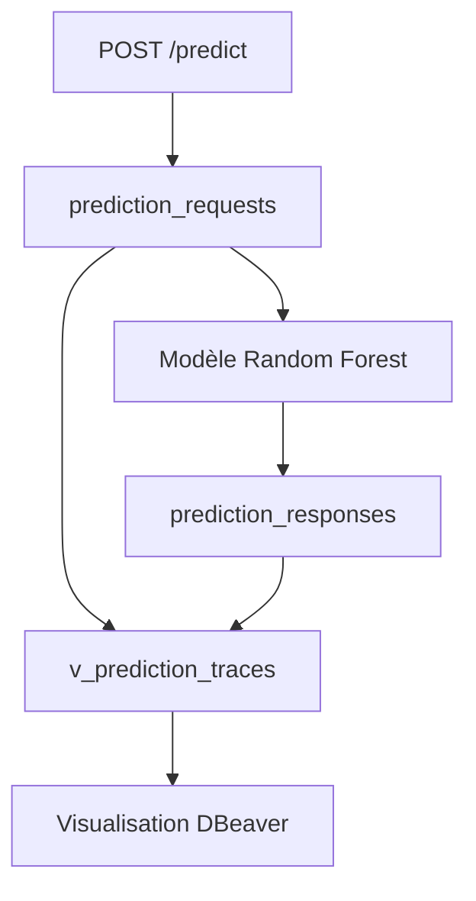

## 🏗️ Architecture API, modèle ML et base de données

Ce projet expose un modèle de machine learning de prédiction d’attrition via une API **FastAPI**.

L’objectif est de proposer une architecture complète permettant :

* d’exposer un modèle de prédiction via une API REST ;
* de charger un modèle ML exporté au format `joblib` ;
* de stocker le dataset complet dans une base PostgreSQL locale ;
* de tracer systématiquement les inputs et outputs de chaque prédiction.

---

## 🧠 Modèle de machine learning

Le modèle utilisé est un **RandomForestClassifier** entraîné sur le dataset central du projet P4.

Il permet de prédire si un collaborateur est susceptible de quitter l’entreprise.

### Fichiers associés

* `scripts/train_export_model.py` : script d’entraînement et d’export du modèle ;
* `models/attrition_random_forest.joblib` : pipeline complet exporté ;
* `models/model_metadata.json` : métadonnées du modèle.

### Métriques obtenues sur le jeu de test

| Métrique  |  Score |
| --------- | -----: |
| Accuracy  | 0.8367 |
| Precision | 0.4865 |
| Recall    | 0.3830 |
| F1-score  | 0.4286 |
| ROC AUC   | 0.7975 |

---

## ⚡ API FastAPI

L’API expose les endpoints suivants :

| Endpoint      | Méthode | Description                                                                |
| ------------- | ------- | -------------------------------------------------------------------------- |
| `/health`     | GET     | Vérifie que l’API fonctionne                                               |
| `/model-info` | GET     | Retourne les informations du modèle chargé                                 |
| `/predict`    | POST    | Envoie les données d’un collaborateur au modèle et retourne une prédiction |

### Documentation interactive locale

```text
http://127.0.0.1:8000/docs
```

### Lancement local de l’API

```bash
python -m uvicorn app.main:app --reload
```

---

## 🐘 Base de données PostgreSQL

La base PostgreSQL est utilisée localement pour stocker le dataset complet et tracer les échanges entre l’API et le modèle.

Le schéma utilisé est :

```text
ml_api
```

### Scripts SQL

| Script                            | Rôle                                           |
| --------------------------------- | ---------------------------------------------- |
| `db/sql/01_create_database.sql`   | Création de la base PostgreSQL                 |
| `db/sql/02_create_tables.sql`     | Création du schéma et des tables               |
| `db/sql/03_load_dataset.sql`      | Insertion du dataset complet                   |
| `db/sql/04_check_database.sql`    | Vérification du contenu de la base             |
| `db/sql/05_trace_predictions.sql` | Vérification de la traçabilité des prédictions |

### Schéma de la base

* `docs/database_schema.mmd`

### Documentation détaillée

* `docs/database.md`
* `docs/model_loading.md`

---

## 🗂️ Tables principales

La base contient trois tables principales.

| Table                         | Description                                    |
| ----------------------------- | ---------------------------------------------- |
| `ml_api.employees_dataset`    | Contient le dataset complet des collaborateurs |
| `ml_api.prediction_requests`  | Stocke les inputs envoyés au modèle            |
| `ml_api.prediction_responses` | Stocke les outputs générés par le modèle       |

---

## 🔍 Traçabilité des prédictions

Chaque appel à `POST /predict` suit le flux suivant :

1. l’input envoyé à l’API est enregistré dans `prediction_requests` ;
2. le modèle de machine learning est appelé ;
3. l’output du modèle est enregistré dans `prediction_responses` ;
4. la réponse est retournée à l’utilisateur.

Cette logique garantit une traçabilité complète entre :

```text
API FastAPI → PostgreSQL → Modèle ML → PostgreSQL → Réponse API
```

### Exemple de vérification SQL

```bash
psql p5_ml_api -f db/sql/05_trace_predictions.sql
```

Exemple de résultat obtenu :

```text
request_id | prediction | prediction_label | probability_leave | model_name              | model_version
-----------|------------|------------------|-------------------|-------------------------|---------------
3          | 1          | leave            | 0.89550           | attrition-random-forest | 0.5.0
2          | 0          | stay             | 0.40030           | attrition-random-forest | 0.5.0
```
## 🖥️ Visualisation PostgreSQL avec DBeaver

Pour faciliter la compréhension du cheminement des données, la base PostgreSQL locale peut être explorée avec **DBeaver Community**.

L’objectif est de montrer visuellement le flux complet :

```text
API FastAPI → PostgreSQL → Modèle ML → PostgreSQL → Réponse API
```

Cette visualisation permet de vérifier que chaque prédiction possède :

* un `request_id` côté input ;
* un `response_id` côté output ;
* une prédiction ;
* une probabilité de départ ;
* un nom de modèle ;
* une version de modèle.

---

### 🔌 Connexion DBeaver

Paramètres de connexion utilisés en local :

| Paramètre | Valeur                       |
| --------- | ---------------------------- |
| Host      | `localhost`                  |
| Port      | `5432`                       |
| Database  | `p5_ml_api`                  |
| Schema    | `ml_api`                     |
| User      | utilisateur PostgreSQL local |

Dans DBeaver, l’arborescence attendue est :

```text
p5_ml_api
└── Schemas
    └── ml_api
        ├── Tables
        │   ├── employees_dataset
        │   ├── prediction_requests
        │   └── prediction_responses
        └── Views
            └── v_prediction_traces
```

---

### 🗂️ Rôle des tables

| Table                         | Rôle                                           |
| ----------------------------- | ---------------------------------------------- |
| `ml_api.employees_dataset`    | Contient le dataset complet des collaborateurs |
| `ml_api.prediction_requests`  | Stocke les inputs envoyés à l’API et au modèle |
| `ml_api.prediction_responses` | Stocke les outputs générés par le modèle       |
| `ml_api.v_prediction_traces`  | Vue SQL de synthèse reliant inputs et outputs  |

---

### 🔁 Cheminement complet des données

Le flux d’une prédiction est le suivant :

```text
1. L'utilisateur appelle POST /predict
              ↓
2. L'input JSON est enregistré dans prediction_requests
              ↓
3. Le modèle ML génère une prédiction
              ↓
4. L'output JSON est enregistré dans prediction_responses
              ↓
5. La réponse est retournée par l'API
              ↓
6. La vue v_prediction_traces permet de contrôler la trace complète
```

---

### 🧩 Schéma logique de traçabilité



---

### 🧾 Scripts SQL associés

| Script                                      | Description                                         |
| ------------------------------------------- | --------------------------------------------------- |
| `db/sql/01_create_database.sql`             | Crée la base PostgreSQL `p5_ml_api`                 |
| `db/sql/02_create_tables.sql`               | Crée le schéma `ml_api` et les tables               |
| `db/sql/03_load_dataset.sql`                | Charge le dataset complet                           |
| `db/sql/04_check_database.sql`              | Vérifie le contenu de la base                       |
| `db/sql/05_trace_predictions.sql`           | Affiche les traces complètes avec les payloads JSON |
| `db/sql/06_create_trace_view.sql`           | Crée la vue `ml_api.v_prediction_traces`            |
| `db/sql/07_visualize_prediction_traces.sql` | Affiche toutes les prédictions de manière lisible   |

---

### ▶️ Ordre d’exécution des scripts PostgreSQL

Pour reconstruire la base depuis zéro :

```bash
psql postgres -f db/sql/01_create_database.sql
psql p5_ml_api -f db/sql/02_create_tables.sql
psql p5_ml_api -f db/sql/03_load_dataset.sql
psql p5_ml_api -f db/sql/06_create_trace_view.sql
```

Pour vérifier le contenu de la base :

```bash
psql p5_ml_api -f db/sql/04_check_database.sql
```

Pour vérifier la traçabilité complète, avec les payloads JSON :

```bash
psql p5_ml_api -f db/sql/05_trace_predictions.sql
```

Pour afficher une synthèse lisible des prédictions :

```bash
psql p5_ml_api -f db/sql/07_visualize_prediction_traces.sql
```

Le script `07_visualize_prediction_traces.sql` n’utilise pas de `LIMIT`. Il affiche donc toutes les traces disponibles dans la base.

---

### 🚀 Générer plus de traces de prédiction

Si la vue `v_prediction_traces` affiche seulement quelques lignes, ce n’est pas une erreur : cela signifie simplement que peu d’appels réels ont été envoyés à l’API.

Chaque appel à `POST /predict` génère :

```text
1 ligne dans prediction_requests
+
1 ligne dans prediction_responses
=
1 ligne visible dans v_prediction_traces
```

Pour générer plusieurs prédictions de démonstration, lancer d’abord l’API :

```bash
python -m uvicorn app.main:app --reload
```

Puis, dans un deuxième terminal, exécuter :

```bash
python scripts/generate_demo_predictions.py
```

Par défaut, le script envoie les 20 premières lignes du dataset à l’API.

Pour choisir un autre nombre de prédictions :

```bash
DEMO_LIMIT=50 python scripts/generate_demo_predictions.py
```

Ensuite, relancer :

```bash
psql p5_ml_api -f db/sql/07_visualize_prediction_traces.sql
```

ou ouvrir DBeaver pour voir les nouvelles lignes dans :

```text
ml_api.v_prediction_traces
```

---

### 🧼 Pourquoi un nettoyage est nécessaire avant l’appel API ?

Le dataset contient certaines valeurs brutes, par exemple :

```text
11 %
```

Alors que l’API attend une valeur numérique :

```text
11
```

Le script `scripts/generate_demo_predictions.py` nettoie donc les valeurs avant de les envoyer à `/predict`.

Sans ce nettoyage, FastAPI peut retourner une erreur :

```text
422 Unprocessable Entity
```

Cette erreur signifie que le JSON envoyé ne respecte pas exactement le schéma attendu par l’API.

---

### 🖱️ Ouverture rapide avec DBeaver

Le projet fournit un script d’ouverture rapide :

```bash
./scripts/open_database_visualization.sh
```

Ce script ouvre DBeaver avec la requête de visualisation :

```text
db/sql/07_visualize_prediction_traces.sql
```

La requête utilisée est :

```sql
SELECT
    request_id,
    response_id,
    prediction,
    prediction_label,
    probability_leave,
    model_name,
    model_version
FROM ml_api.v_prediction_traces
ORDER BY request_id DESC;
```

Exemple de résultat attendu :

```text
request_id | response_id | prediction | prediction_label | probability_leave | model_name              | model_version
3          | 3           | 1          | leave            | 0.89550           | attrition-random-forest | 0.5.0
2          | 2           | 0          | stay             | 0.40030           | attrition-random-forest | 0.5.0
1          | 1           | 1          | leave            | 0.74450           | attrition-baseline-api  | 0.3.0
```

Après génération de nouvelles prédictions, cette table affiche davantage de lignes.

---

### ✅ Intérêt pour le projet

Cette visualisation permet de démontrer clairement que toutes les interactions avec le modèle passent par la base de données.

Elle répond directement à l’objectif de traçabilité :

```text
input API stocké → prédiction générée → output stocké → trace consultable
```

DBeaver sert donc de support visuel pour auditer les prédictions et montrer la cohérence entre l’API, PostgreSQL et le modèle de machine learning.


## ✅ Tests

Les tests sont exécutés avec :

```bash
python -m pytest --cov=app --cov-report=term-missing
```

Résultat validé :

```text
6 passed
coverage 90%
```

---

## 🚀 Versions du projet

| Version             | Contenu                         |
| ------------------- | ------------------------------- |
| `v0.1.0` / `v0.1.1` | Structure initiale du projet    |
| `v0.2.0`            | Pipeline CI/CD                  |
| `v0.3.0`            | API FastAPI                     |
| `v0.4.0` / `v0.4.1` | PostgreSQL et traçabilité       |
| `v0.5.0`            | Chargement du modèle ML exporté |
