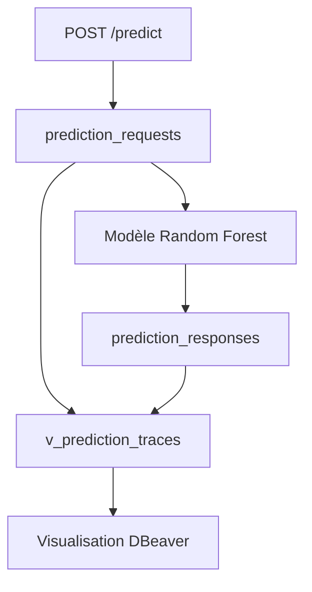

# 🚀 P5 — Déployez un modèle de Machine Learning

## 🏗️ Architecture API, modèle ML et base de données

Ce projet expose un modèle de machine learning de prédiction d’attrition via une API **FastAPI**.

L’objectif est de proposer une architecture complète permettant :

* d’exposer un modèle de prédiction via une API REST ;
* de charger un modèle ML exporté au format `joblib` ;
* de stocker le dataset complet dans une base PostgreSQL locale ;
* de tracer systématiquement les inputs et outputs de chaque prédiction ;
* de tester l’API, les schémas Pydantic, le service modèle et la logique de traçabilité ;
* de générer un rapport de couverture de tests.

Le flux global du projet est le suivant :

```text
Utilisateur → API FastAPI → Modèle ML → PostgreSQL → Réponse API
```

---

## 🧠 Modèle de machine learning

Le modèle utilisé est un **RandomForestClassifier** entraîné sur le dataset central du projet P4.

Il permet de prédire si un collaborateur est susceptible de quitter l’entreprise.

### Fichiers associés

| Fichier                                 | Rôle                                        |
| --------------------------------------- | ------------------------------------------- |
| `scripts/train_export_model.py`         | Script d’entraînement et d’export du modèle |
| `models/attrition_random_forest.joblib` | Pipeline complet exporté                    |
| `models/model_metadata.json`            | Métadonnées du modèle                       |

### Métriques obtenues sur le jeu de test

| Métrique  |  Score |
| --------- | -----: |
| Accuracy  | 0.8367 |
| Precision | 0.4865 |
| Recall    | 0.3830 |
| F1-score  | 0.4286 |
| ROC AUC   | 0.7975 |

Ces métriques permettent de contrôler la qualité globale du modèle, tout en gardant une trace de ses limites, notamment sur la classe minoritaire liée à l’attrition.

---

## ⚡ API FastAPI

L’API expose les endpoints suivants :

| Endpoint      | Méthode | Description                                                                |
| ------------- | ------- | -------------------------------------------------------------------------- |
| `/`           | GET     | Redirige vers la documentation Swagger                                     |
| `/health`     | GET     | Vérifie que l’API fonctionne                                               |
| `/model-info` | GET     | Retourne les informations du modèle chargé                                 |
| `/predict`    | POST    | Envoie les données d’un collaborateur au modèle et retourne une prédiction |

### Documentation interactive locale

```text
http://127.0.0.1:8000/docs
```

### Lancement local de l’API

```bash
python -m uvicorn app.main:app --reload
```

### Exemple de sortie `/predict`

```json
{
  "prediction": 1,
  "prediction_label": "leave",
  "probability_leave": 0.8955,
  "model_name": "attrition-random-forest",
  "model_version": "0.5.0"
}
```

La règle métier utilisée est :

```text
probability_leave >= 0.5 → leave
probability_leave < 0.5  → stay
```

---

## 🐘 Base de données PostgreSQL

La base PostgreSQL est utilisée localement pour stocker le dataset complet et tracer les échanges entre l’API et le modèle.

Le schéma utilisé est :

```text
ml_api
```

### Tables principales

| Table                         | Description                                    |
| ----------------------------- | ---------------------------------------------- |
| `ml_api.employees_dataset`    | Contient le dataset complet des collaborateurs |
| `ml_api.prediction_requests`  | Stocke les inputs envoyés au modèle            |
| `ml_api.prediction_responses` | Stocke les outputs générés par le modèle       |
| `ml_api.v_prediction_traces`  | Vue SQL reliant les inputs et les outputs      |

---

## 🧾 Scripts SQL

| Script                                      | Rôle                                                         |
| ------------------------------------------- | ------------------------------------------------------------ |
| `db/sql/01_create_database.sql`             | Création de la base PostgreSQL `p5_ml_api`                   |
| `db/sql/02_create_tables.sql`               | Création du schéma `ml_api` et des tables                    |
| `db/sql/03_load_dataset.sql`                | Insertion du dataset complet                                 |
| `db/sql/04_check_database.sql`              | Vérification du contenu de la base                           |
| `db/sql/05_trace_predictions.sql`           | Vérification détaillée de la traçabilité des prédictions     |
| `db/sql/06_create_trace_view.sql`           | Création de la vue `ml_api.v_prediction_traces`              |
| `db/sql/07_visualize_prediction_traces.sql` | Visualisation lisible de toutes les prédictions enregistrées |

### Reconstruction de la base

```bash
psql postgres -f db/sql/01_create_database.sql
psql p5_ml_api -f db/sql/02_create_tables.sql
psql p5_ml_api -f db/sql/03_load_dataset.sql
psql p5_ml_api -f db/sql/06_create_trace_view.sql
```

### Vérifier le contenu de la base

```bash
psql p5_ml_api -f db/sql/04_check_database.sql
```

### Vérifier les traces complètes

```bash
psql p5_ml_api -f db/sql/05_trace_predictions.sql
```

### Visualiser toutes les prédictions

```bash
psql p5_ml_api -f db/sql/07_visualize_prediction_traces.sql
```

Le script `07_visualize_prediction_traces.sql` **n’utilise pas de `LIMIT`**.
Il affiche donc toutes les traces disponibles dans la base.

---

## 🔍 Traçabilité des prédictions

Chaque appel à `POST /predict` suit le flux suivant :

```text
1. L'utilisateur appelle POST /predict
              ↓
2. L'input JSON est enregistré dans prediction_requests
              ↓
3. Le modèle ML génère une prédiction
              ↓
4. L'output JSON est enregistré dans prediction_responses
              ↓
5. La réponse est retournée par l'API
              ↓
6. La vue v_prediction_traces permet de contrôler la trace complète
```

Cette logique garantit une traçabilité complète entre :

```text
API FastAPI → PostgreSQL → Modèle ML → PostgreSQL → Réponse API
```

### Exemple de vérification SQL

```bash
psql p5_ml_api -f db/sql/05_trace_predictions.sql
```

Exemple de résultat :

```text
request_id | prediction | prediction_label | probability_leave | model_name              | model_version
-----------|------------|------------------|-------------------|-------------------------|---------------
3          | 1          | leave            | 0.89550           | attrition-random-forest | 0.5.0
2          | 0          | stay             | 0.40030           | attrition-random-forest | 0.5.0
```

---

## 🖥️ Visualisation PostgreSQL avec DBeaver

Pour faciliter la compréhension du cheminement des données, la base PostgreSQL locale peut être explorée avec **DBeaver Community**.

L’objectif est de montrer visuellement le flux complet :

```text
API FastAPI → PostgreSQL → Modèle ML → PostgreSQL → Réponse API
```

### Connexion DBeaver

Paramètres de connexion utilisés en local :

| Paramètre | Valeur                       |
| --------- | ---------------------------- |
| Host      | `localhost`                  |
| Port      | `5432`                       |
| Database  | `p5_ml_api`                  |
| Schema    | `ml_api`                     |
| User      | utilisateur PostgreSQL local |

Dans DBeaver, l’arborescence attendue est :

```text
p5_ml_api
└── Schemas
    └── ml_api
        ├── Tables
        │   ├── employees_dataset
        │   ├── prediction_requests
        │   └── prediction_responses
        └── Views
            └── v_prediction_traces
```

### Vue de synthèse

La vue SQL dédiée est :

```text
ml_api.v_prediction_traces
```

Elle permet de visualiser rapidement :

* le `request_id` ;
* le `response_id` ;
* la prédiction ;
* le libellé métier `stay` ou `leave` ;
* la probabilité de départ ;
* le nom du modèle ;
* la version du modèle.

### Schéma logique de traçabilité



### Ouverture rapide avec DBeaver

Le projet fournit un script d’ouverture rapide :

```bash
./scripts/open_database_visualization.sh
```

Ce script ouvre DBeaver avec la requête de visualisation :

```text
db/sql/07_visualize_prediction_traces.sql
```

La requête utilisée est :

```sql
SELECT
    request_id,
    response_id,
    prediction,
    prediction_label,
    probability_leave,
    model_name,
    model_version
FROM ml_api.v_prediction_traces
ORDER BY request_id DESC;
```

---

## 🚀 Générer plus de traces de prédiction

Si la vue `v_prediction_traces` affiche seulement quelques lignes, ce n’est pas une erreur. Cela signifie simplement que peu d’appels réels ont été envoyés à l’API.

Chaque appel à `POST /predict` génère :

```text
1 ligne dans prediction_requests
+
1 ligne dans prediction_responses
=
1 ligne visible dans v_prediction_traces
```

Pour générer plusieurs prédictions de démonstration, lancer d’abord l’API :

```bash
python -m uvicorn app.main:app --reload
```

Puis, dans un deuxième terminal, exécuter :

```bash
python scripts/generate_demo_predictions.py
```

Par défaut, le script envoie les 20 premières lignes du dataset à l’API.

Pour choisir un autre nombre de prédictions :

```bash
DEMO_LIMIT=50 python scripts/generate_demo_predictions.py
```

Ensuite, relancer :

```bash
psql p5_ml_api -f db/sql/07_visualize_prediction_traces.sql
```

ou ouvrir DBeaver pour voir les nouvelles lignes dans :

```text
ml_api.v_prediction_traces
```

### Nettoyage des données avant appel API

Le dataset contient certaines valeurs brutes, par exemple :

```text
11 %
```

Alors que l’API attend une valeur numérique :

```text
11
```

Le script `scripts/generate_demo_predictions.py` nettoie donc les valeurs avant de les envoyer à `/predict`.

Sans ce nettoyage, FastAPI peut retourner :

```text
422 Unprocessable Entity
```

Cette erreur signifie que le JSON envoyé ne respecte pas exactement le schéma attendu par l’API.

---

## ✅ Tests unitaires et fonctionnels

Le projet contient une suite de tests permettant de vérifier la robustesse de l’API, du modèle, des schémas Pydantic et de la traçabilité.

### Organisation des tests

| Fichier                                | Rôle                                                                      |
| -------------------------------------- | ------------------------------------------------------------------------- |
| `tests/conftest.py`                    | Fixtures communes : client FastAPI, payload valide, mock PostgreSQL       |
| `tests/test_health.py`                 | Tests de l’endpoint `/health`                                             |
| `tests/test_prediction.py`             | Tests API de `/model-info` et `/predict`                                  |
| `tests/test_schemas.py`                | Tests unitaires des schémas Pydantic                                      |
| `tests/test_model_service.py`          | Tests du service de chargement et d’appel du modèle                       |
| `tests/test_prediction_log_service.py` | Tests de la logique de traçabilité PostgreSQL avec faux moteur SQLAlchemy |
| `tests/test_functional_api.py`         | Tests fonctionnels du parcours complet API                                |

### Lancer les tests

```bash
python -m pytest
```

### Lancer les tests avec couverture

```bash
python -m pytest --cov=app --cov-report=term-missing
```

### Générer le rapport de couverture HTML et XML

```bash
python -m pytest \
  --cov=app \
  --cov-report=term-missing \
  --cov-report=xml:reports/coverage.xml \
  --cov-report=html:reports/coverage_html
```

### Ouvrir le rapport HTML

```bash
open reports/coverage_html/index.html
```

Le rapport HTML permet de visualiser précisément :

* les fichiers couverts par les tests ;
* les lignes exécutées ;
* les lignes non couvertes ;
* le taux global de couverture.

### Résultat attendu

Selon l’état actuel de la suite de tests :

```text
24 passed
coverage >= 90%
```

Le nombre exact peut évoluer si de nouveaux tests sont ajoutés.

---

## 🔁 CI/CD GitHub Actions

Le projet utilise GitHub Actions pour automatiser :

* l’installation des dépendances ;
* l’exécution des tests ;
* la génération des rapports de couverture ;
* le déploiement vers Hugging Face Spaces après validation sur `main`.

Le workflow principal est :

```text
.github/workflows/ci-cd.yml
```

### Branches surveillées

Le pipeline se déclenche sur :

```text
main
develop
feature/**
```

### Étapes principales du pipeline

```text
Checkout repository
        ↓
Setup Python 3.11
        ↓
Install dependencies
        ↓
Run tests with coverage
        ↓
Upload coverage report
        ↓
Deploy to Hugging Face Spaces
```

Le déploiement vers Hugging Face Spaces est exécuté uniquement lorsque les tests passent sur la branche `main`.

---

## 📚 Documentation projet

| Fichier                    | Description                                   |
| -------------------------- | --------------------------------------------- |
| `docs/database.md`         | Documentation détaillée de la base PostgreSQL |
| `docs/database_schema.mmd` | Schéma Mermaid de la base                     |
| `docs/model_loading.md`    | Documentation sur le chargement du modèle     |
| `README.md`                | Documentation principale du projet            |

---

## 🚀 Versions du projet

| Version             | Contenu                                                       |
| ------------------- | ------------------------------------------------------------- |
| `v0.1.0` / `v0.1.1` | Structure initiale du projet                                  |
| `v0.2.0`            | Pipeline CI/CD                                                |
| `v0.3.0`            | API FastAPI                                                   |
| `v0.4.0` / `v0.4.1` | PostgreSQL et traçabilité                                     |
| `v0.5.0`            | Chargement du modèle ML exporté                               |
| `v0.5.6`            | Visualisation PostgreSQL avec DBeaver                         |
| `v0.6.0`            | Tests unitaires, tests fonctionnels et rapports de couverture |

---

## ✅ Résumé

Ce projet démontre une chaîne complète de déploiement machine learning :

```text
Dataset P4 → Modèle Random Forest → API FastAPI → PostgreSQL → Tests → CI/CD → Hugging Face Spaces
```

Il couvre les principaux attendus du projet :

* exposition d’un modèle ML via une API ;
* chargement d’un modèle exporté ;
* traçabilité complète des prédictions ;
* visualisation PostgreSQL avec DBeaver ;
* tests unitaires et fonctionnels ;
* rapport de couverture ;
* pipeline CI/CD automatisé.
